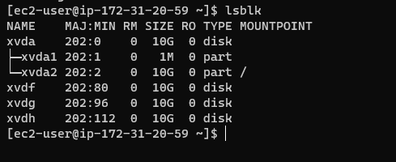
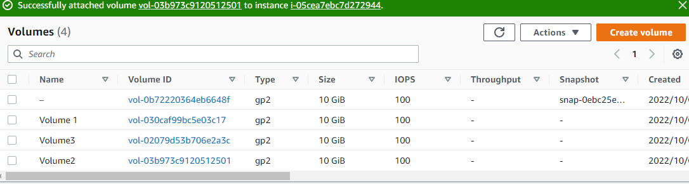
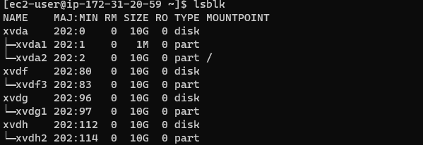
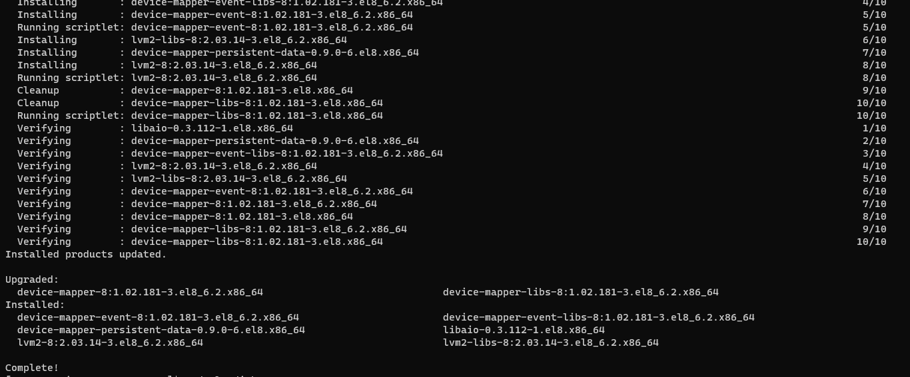
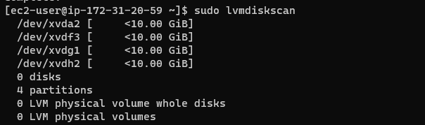
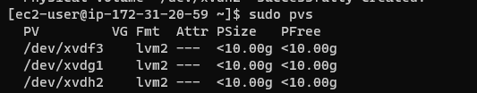
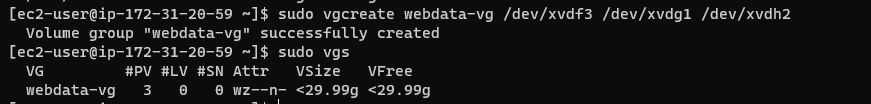
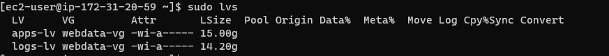
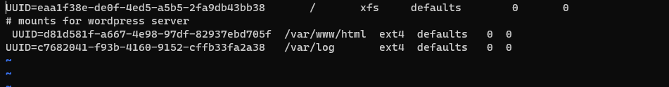

# LAUNCH AN EC2 INSTANCE THAT WILL SERVE AS “WEB SERVER”

## Step 1 — Prepare a Web Server

### Create 3 volumes in the same AZ as your Web Server EC2, each of 10 GiB.

`lsblk`

###  Create a single partition on each of the 3 disks

`sudo gdisk /dev/xvdf`

`sudo gdisk /dev/xvdg`

`sudo gdisk /dev/xvdh`

### Install lvm2 package

`sudo yum install lvm2`

`sudo lvmdiskscan`

### Physical Volume Creation

`sudo pvcreate /dev/xvdf1`

`sudo pvcreate /dev/xvdh1`

`sudo pvcreate /dev/xvdg1`

### Creating Volume Group and Adding the 3 Physical Volume Into it

`sudo vgcreate webdata-vg /dev/xvdh1 /dev/xvdg1 /dev/xvdf1`

### Create 2 Logical Volume

`sudo lvcreate -n apps-lv -L 15G webdata-vg`

`sudo lvcreate -n logs-lv -L 14G webdata-vg`

### Format the Logical Volumes With ext4 Filesystem

`sudo mkfs -t ext4 /dev/webdata-vg/apps-lv`

`sudo mkfs -t ext4 /dev/webdata-vg/logs-lv`

###  Creating Directories to Store and Mount

`sudo mkdir -p /var/www/html`

`sudo mkdir -p /home/recovery/logs`

`sudo mount /dev/webdata-vg/apps-lv /var/www/html/`

`sudo rsync -av /var/log/. /home/recovery/logs/`

`sudo mount /dev/webdata-vg/logs-lv /var/log`

`sudo rsync -av /home/recovery/logs/. /var/log`

### Update the UUID IN `/etc/fstab` File

`sudo blkid /dev/webdata-vg/apps-lv`

`sudo vi /etc/fstab`

`:!sudo blkid /dev/webdata-vg/logs-lv`

`code`
`code`
`code`
`code`
`code`
`code`
`code`
`code`
`code`
`code`
`code`
`code`
`code`
`code`
`code`
`code`